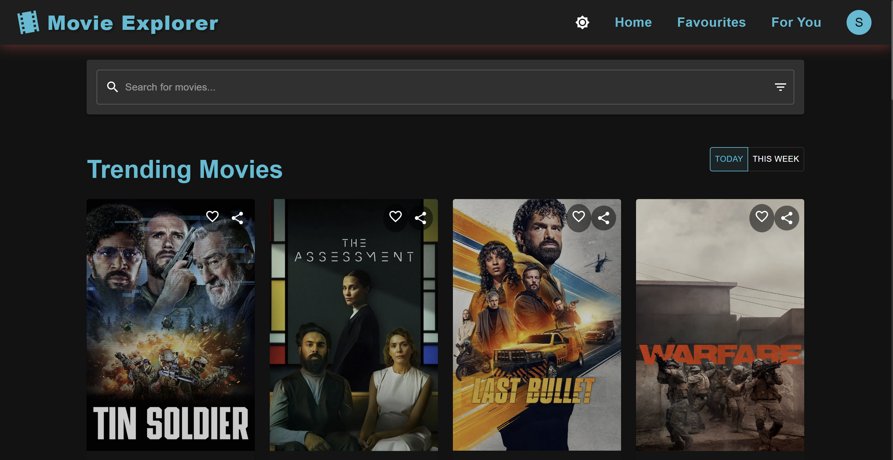

# 🎬 Movie Explorer

A modern, responsive web application that allows users to discover, search, and explore movies using The Movie Database (TMDb) API.


✨ Features
🌟 Core Features

🔍 Search Movies: Find movies by title with real-time results

🔥 Browse Trending: Discover what's popular today or this week

🔢 Advanced Filtering: Filter movies by genre, year, and rating

📝 Detailed Information: View comprehensive details about any movie including:

Overview, cast, and crew
Ratings and release information
Trailers and related videos
Production details

💖 Favorites: Save your favorite movies for later viewing

🌓 Dark/Light Mode: Toggle between dark and light themes

📱 Responsive Design: Optimized for all device sizes from mobile to desktop

✨ Smooth Animations: Subtle animations and transitions throughout the app

🔐 User Authentication: Create an account to save preferences and favorites

💾 Persistent Storage: Remembers your favorites and last search even after closing the browser


🚀 Special Features


📊 Enhanced User Experience


⏬ "Load More" Button: Implemented a button-based pagination instead of infinite scroll for better user control

🎬 In-App YouTube Trailers: Watch movie trailers directly within the app without navigating away

Note: Please allow up to 10 seconds for trailer playback to begin as loading times may vary


✨ Animated Movie Cards: Engaging hover effects and transitions when interacting with movie posters

❤️ Quick Favorites: Add movies to favorites with a single click from any view

🔗 Social Sharing: Share your favorite movies directly to social media or copy links to share with friends


🎯 Personalized Recommendations


🎁 "For You" Section: Personalized movie recommendations based on your favorite genres

🧠 Smart Genre Detection: Automatically identifies patterns in your favorite movies to suggest similar content


🔑 Easy Access Instructions


🚪 Quick Login: To access favorites and movie recommendation features, simply login with any username and password combination

🎭 No Registration Required: The app doesn't require a real email or verification—just enter credentials to unlock all features


🎞️ Video Player Enhancements


🖼️ Trailer Thumbnail Previews: Visual preview of trailers before playing

📺 Multiple Playback Options: Watch trailers in-app or open directly in YouTube based on your preference

📋 Multi-Trailer Support: Browse all available trailers and teasers for each movie


📤 Sharing Features


📱 Web Share API Integration: Modern sharing capabilities on supported devices

🔗 Direct Social Media Links: Share directly to Twitter, Facebook, and WhatsApp

📋 One-Click Link Copying: Easily copy movie links to clipboard for sharing anywhere

🔄 Context-Aware Sharing: Share from both movie cards and detailed movie views


🌐 Cross-Platform Compatibility


💻 Desktop Optimized: Full-featured experience on larger screens

📱 Mobile Responsive: Touch-friendly interface that works great on smartphones

⚡ Performance Focused: Fast loading times and smooth animations on all devices


🧩 Customization Options


🌓 Theme Preferences: Switch between light and dark mode based on your preference

🔄 Persistent Settings: Your preferences stay saved between sessions

🔍 Search History: Quickly access your previous searches


## 🛠️ Technologies

- **React 18**: Modern UI building with functional components and hooks
- **Material UI 5**: Sleek, responsive component library
- **React Router 6**: Navigation and routing
- **Axios**: API requests to TMDb
- **Framer Motion**: Advanced animations and transitions
- **Context API**: Global state management
- **LocalStorage**: Persistent data storage
- **TMDb API**: Movie database with comprehensive information

## 📱 Usage

### Searching Movies

1. Use the search bar at the top of the home page
2. Type a movie title and press Enter or click the search icon
3. Browse through results in the grid view
4. Click on any movie poster to see detailed information

### Filtering Results

1. Click the filter icon next to the search bar
2. Select genre, year, and/or minimum rating
3. Click "Apply Filters" to refine your search

### Trending Movies

1. On the home page, view trending movies automatically
2. Toggle between "Today" and "This Week" to see different trending periods

### Saving Favorites

1. Click the heart icon on any movie card or detail page
2. Access all your favorites from the "Favorites" link in the navigation bar
   (requires login)

### Theme Switching

- Click the theme toggle button in the header to switch between dark and light mode

## 📁 Project Structure

```
movie-explorer/
├── public/
├── src/
│   ├── components/
│   │   ├── Auth/         # Authentication components
│   │   ├── Layout/       # Layout components (Header, Footer)
│   │   ├── Movie/        # Movie-related components
│   │   └── UI/           # Reusable UI components
│   ├── context/          # Context providers
│   ├── hooks/            # Custom React hooks
│   ├── pages/            # Page components
│   ├── services/         # API services
│   └── utils/            # Utility functions
├── .env                  # Environment variables
└── package.json
```

The app uses the following API endpoints:

- `/trending/movie/{time_window}`: Get trending movies
- `/search/movie`: Search for movies
- `/movie/{movie_id}`: Get detailed movie information
- `/genre/movie/list`: Get movie genres list
- `/discover/movie`: Get movies by genre
